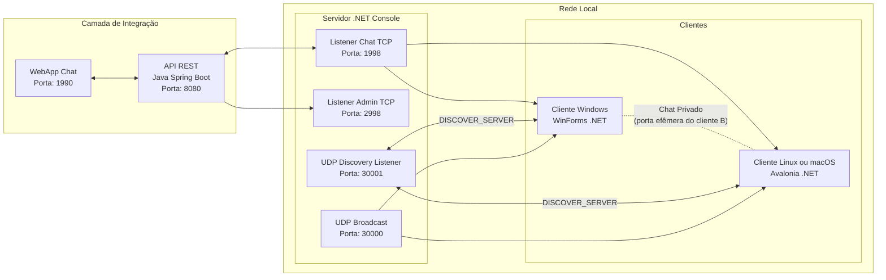

# CSI301 – 25.1 – Redes de Computadores I

## 👤 Discente
**Luccas Vinicius P. A. Santos Carneiro**

---

## 📄 Descrição Geral
Sistema **Cliente/Servidor TCP** com **Descoberta Automática de Servidor (UDP)**, **mensagens broadcast e privadas**, **admin TCP**, **clientes gráficos multiplataforma** e recursos **extras** de integração via **API REST Java** e **aplicativo Web React**.

---

## 📌 Escopo

- **Implementações Obrigatórias**:
  - Servidor TCP com suporte a múltiplos clientes.
  - Descoberta automática de servidor via UDP.
  - Troca de mensagens broadcast e privadas.
  - Cliente gráfico multiplataforma (Windows/Linux).
  - Comandos administrativos via TCP.

- **Implementações Extras**:
  - API REST (Java Spring Boot) para integração remota.
  - Aplicativo Web React para interação com o servidor.
  - WebChat opcional integrado à API.

---

## ⚙️ Tecnologias Utilizadas
- **.NET 8.0** (C#)
- **Windows Forms** e **Avalonia UI**
- **Java 17** + **Spring Boot** + **Maven**
- **React.js** + **Axios**
- **TCP Sockets** e **UDP Broadcast**
- **API REST**
- **JPA/Hibernate** (no módulo Java)

---

## ✅ Funcionalidades Obrigatórias
- **Servidor TCP com múltiplos listeners**:
  - **Chat** (TCP **1998**): recepção de broadcast, lista e comandos.
  - **Admin** (TCP **2998**): status, listagem, desconexão.
- **Descoberta Automática**:
  - **Anúncio** do IP do servidor via **UDP 30000**.
  - **Responder** a `DISCOVER_SERVER` em **UDP 30001**.
- **Handshakes de Clientes**:
  - Envio de `apelido;portaPrivada` no connect.
  - **Lista de usuários** (`/lista`) com `apelido;ip;portaPrivada`.
- **Mensagens**:
  - **Broadcast** para todos.
  - **Privado P2P**: cliente A conecta na porta privada do cliente B; janelas dedicadas abrem automaticamente.
- **Comandos Suportados** (via Chat/Admin):
  - `/count` — total de conectados
  - `/lista` — lista com `apelido;ip;porta`
  - `/desconectar <apelido>` — derruba usuário
  - `/status` — uptime + conectados
- **Clientes Multi-plataforma**:
  - **WinForms** (Windows).
  - **Avalonia** (Linux/macOS).

---

## 🔹 Funcionalidades Extras

### 1. API REST (Java Spring Boot)
Permite administração e consulta remota dos clientes e mensagens.

**Principais Endpoints:**
| Método | Endpoint                              | Descrição                                                |
|--------|---------------------------------------|----------------------------------------------------------|
| GET    | `/api/status`                         | Retorna status do servidor (uptime, conectados).         |
| GET    | `/api/usuarios/listar`                | Lista usuários conectados (`apelido;ip;portaPrivada`).   |
| GET    | `/api/usuarios/count`                 | Contagem de usuários conectados.                         |
| POST   | `/api/messages/send`                  | Envia mensagem broadcast para todos os clientes.         |
| GET    | `/api/messages/get`                   | Obtém mensagens enviadas por broadcast.                  |
| GET    | `/api/desconectar?apelido={apelido}`  | Desconecta um cliente específico pelo apelido.           |

---

### 2. Aplicativo Web React
Interface web simples para enviar e receber mensagens broadcast via API REST.

**Principais Recursos:**
- Conectar com apelido.
- Enviar mensagens broadcast.
- Receber mensagens em tempo real (atualização a cada 1 segundo).
- Desconectar manualmente.

---

## 🚪 Portas Padrão
| Serviço                                | Porta |
|----------------------------------------|-------|
| Servidor TCP (Chat)                    | **1998** |
| Servidor TCP (Admin)                   | **2998** |
| UDP Broadcast (anúncio IP servidor)    | **30000** |
| UDP Discovery Listener (servidor)      | **30001** |
| API REST Spring Boot (Extra)           | **8080** |
| WebChat React (Extra)                  | **1990** |

> As portas privadas dos clientes são **efêmeras** (alocadas dinamicamente) e divulgadas ao servidor no handshake.

---

## 🗂️ Estrutura (arquivos-chave)
- **Servidor TCP (.NET Console)**: `Program.cs`
- **Cliente Windows (WinForms)**: `ClienteChat.cs`, `JanelaChatPrivado.cs`
- **Cliente Linux (Avalonia)**: `MainWindow.axaml.cs`, `PrivateChatWindow.axaml.cs`, `App.axaml.cs`, `Program.cs`
- **API REST (Java)**: `ApiChatTcpApplication.java`, `Controller.java`, `ChatDTO.java`
- **WebApp React**: `App.jsx`

---

## 🧭 Fluxo Operacional
1. **Servidor** sobe listeners **1998** (chat) e **2998** (admin).
2. **Servidor**:
   - Responde **DISCOVER_SERVER** em **UDP 30001**.
   - Faz **broadcast** do IP em **UDP 30000** (intervalo periódico).
3. **Cliente**:
   - Descobre IP do servidor (UDP) e conecta em **1998** enviando `apelido;portaPrivada`.
   - Usa `/lista` para obter `apelido;ip;porta` dos peers.
   - Abre **Chat Privado** conectando direto no peer (`ip:portaPrivada`).
4. **Admin**:
   - Comandos `/status`, `/count`, `/lista`, `/desconectar <apelido>`.
5. **API REST (extra):**:
   - Permite listar usuários, enviar broadcast, derrubar clientes..
6. **WebApp React (extra)**:
   - Consome a API REST para enviar/receber mensagens..

---

## ▶️ Execução (resumo)
### Servidor (.NET)
```bash
cd ..\Chat_TCP\ServidorChat
dotnet run
```
### Cliente Windows (WinForms)
```bash
cd ..\Chat_TCP\ClienteChat
dotnet run
```

### Cliente Linux e macOS (Avalonia)
```bash
cd ..\Chat_TCP\ClienteChatLinux
dotnet run
```

### API REST (Spring Boot) (Extra)
```bash
cd ..\Chat_TCP\API_Chat_TCP\
mvn spring-boot:run
```

### WebApp Chat (React) (Extra)
```bash
cd ..\Chat_TCP\WebApp\chat-web
npm install
npm start
```

## 🌐 Endpoints REST (Extra)

Base URL: `http://<IP_SERVIDOR_API>:8080`

| Método | Endpoint                              | Descrição                                                |
|--------|---------------------------------------|----------------------------------------------------------|
| GET    | `/api/status`                         | Retorna status do servidor (uptime, conectados).         |
| GET    | `/api/usuarios/listar`                | Lista usuários conectados (`apelido;ip;portaPrivada`).   |
| GET    | `/api/usuarios/count`                 | Contagem de usuários conectados.                         |
| POST   | `/api/messages/send`                  | Envia mensagem broadcast para todos os clientes.         |
| GET    | `/api/messages/get`                   | Obtem mensagens enviadas por broadcast.                  |
| GET    | `/api/desconectar?apelido={apelido}`  | Desconecta um cliente específico pelo apelido.           |

---

### 📌 Exemplos de Uso (Extra)

**Consultar Status**
```bash
curl --location 'http://localhost:8080/api/status'
```

**Listar Usuários**
```bash
curl --location 'http://localhost:8080/api/usuarios/listar'
```

**Contagem de Usuários**
```bash
curl --location 'http://localhost:8080/api/usuarios/count'
```

**Enviar Broadcast**
```bash
curl --location 'http://localhost:8080/api/messages/send' \
--header 'Content-Type: application/json' \
--data '{
  "mensagem": "Olá a todos, esta é uma mensagem de broadcast enviada via Spring Boot."
}
'
```

**Receber Broadcast**
```bash
curl --location 'http://localhost:8080/api/messages/get'
```

**Desconectar Usuário**
```bash
curl --location 'http://localhost:8080/api/desconectar?apelido=Luccas'
```

## 📈 Diagramas

### Arquitetura

