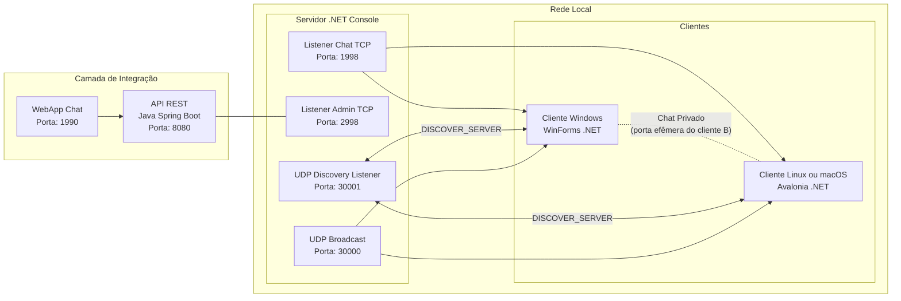

# CSI301 – 25.1 – Redes de Computadores I

## 👤 Discente
**Luccas Vinicius P. A. Santos Carneiro**

---

## 📄 Descrição Geral
Sistema **Cliente/Servidor TCP** com **Descoberta Automática de Servidor (UDP)**, **mensagens broadcast e privadas**, **admin TCP**, **clientes gráficos multiplataforma** e **API REST Java** para integração.

Componentes:
- **Servidor TCP (.NET)**: gerencia conexões, broadcast e comandos.
- **Admin TCP**: status, listagem e desconexão remota.
- **Cliente Windows (WinForms .NET)** e **Cliente Linux (Avalonia .NET)**.
- **API REST (Java Spring Boot)** para operações remotas.
- **WebChat React (opcional)**.

---

## ⚙️ Tecnologias Utilizadas
- **.NET 8.0** (C#)
- **Windows Forms** e **Avalonia UI**
- **Java 17** + **Spring Boot** + **Maven**
- **TCP Sockets** e **UDP Broadcast**
- **API REST**
- **JPA/Hibernate** (no módulo Java)

---

## ✅ Funcionalidades Implementadas
- **Servidor TCP com múltiplos listeners**:
  - **Chat** (TCP **1998**): recepção de broadcast, lista e comandos.
  - **Admin** (TCP **2998**): status, listagem, desconexão.
- **Descoberta Automática**:
  - **Anúncio** do IP do servidor via **UDP 30000**.
  - **Responder** a `DISCOVER_SERVER` em **UDP 30001**.
- **Handshakes de Clientes**:
  - Envio de `apelido;portaPrivada` no connect.
  - **Lista de usuários** (`/lista`) com `apelido;ip;portaPrivada`.
- **Mensagens**:
  - **Broadcast** para todos.
  - **Privado P2P**: cliente A conecta na porta privada do cliente B; janelas dedicadas abrem automaticamente.
- **Comandos Suportados** (via Chat/Admin):
  - `/count` — total de conectados
  - `/lista` — lista com `apelido;ip;porta`
  - `/desconectar <apelido>` — derruba usuário
  - `/status` — uptime + conectados
- **Clientes Multi-plataforma**:
  - **WinForms** (Windows).
  - **Avalonia** (Linux).
- **Integração REST (Java)**:
  - Endpoints administrativos e de consulta (módulo Spring Boot).

---

## 🚪 Portas Padrão
| Serviço                                | Porta |
|----------------------------------------|-------|
| Servidor TCP (Chat)                    | **1998** |
| Servidor TCP (Admin)                   | **2998** |
| UDP Broadcast (anúncio IP servidor)    | **30000** |
| UDP Discovery Listener (servidor)      | **30001** |
| API REST (Spring Boot)                 | **8080** |
| WebChat (React – opcional)             | **1990** |

> As portas privadas dos clientes são **efêmeras** (alocadas dinamicamente) e divulgadas ao servidor no handshake.

---

## 🗂️ Estrutura (arquivos-chave)
- **Servidor TCP (.NET Console)**: `Program.cs`
- **Cliente Windows (WinForms)**: `ClienteChat.cs`, `JanelaChatPrivado.cs`
- **Cliente Linux (Avalonia)**: `MainWindow.axaml.cs`, `PrivateChatWindow.axaml.cs`, `App.axaml.cs`, `Program.cs`
- **API REST (Java)**: `ApiChatTcpApplication.java`, `Controller.java`, `ChatDTO.java`

---

## 🧭 Fluxo Operacional
1. **Servidor** sobe listeners **1998** (chat) e **2998** (admin).
2. **Servidor**:
   - Responde **DISCOVER_SERVER** em **UDP 30001**.
   - Faz **broadcast** do IP em **UDP 30000** (intervalo periódico).
3. **Cliente**:
   - Descobre IP do servidor (UDP) e conecta em **1998** enviando `apelido;portaPrivada`.
   - Usa `/lista` para obter `apelido;ip;porta` dos peers.
   - Abre **Chat Privado** conectando direto no peer (`ip:portaPrivada`).
4. **Admin**:
   - Comandos `/status`, `/count`, `/lista`, `/desconectar <apelido>`.

---

## ▶️ Execução (resumo)
### Servidor (.NET)
```bash
dotnet run --project src/ServidorTcp
```
### Cliente Windows (WinForms)
```bash
dotnet run --project src/ClienteWinForms
```

### Cliente Linux (Avalonia)
```bash
dotnet run --project src/ClienteAvalonia
```

### API REST (Spring Boot)
```bash
mvn spring-boot:run -pl api-java
```

## 🌐 Endpoints REST

Base URL: `http://<IP_SERVIDOR_API>:8080`

| Método | Endpoint                | Descrição                                                     |
|--------|-------------------------|---------------------------------------------------------------|
| GET    | `/api/chat/status`      | Retorna status do servidor (uptime, conectados).             |
| GET    | `/api/chat/lista`       | Lista usuários conectados (`apelido;ip;portaPrivada`).       |
| POST   | `/api/chat/enviar`      | Envia mensagem broadcast para todos os clientes conectados.  |
| POST   | `/api/chat/desconectar` | Desconecta um cliente específico pelo apelido.               |

---

### 📌 Exemplos de Uso

**Consultar Status**
```bash
curl -X GET http://localhost:8080/api/chat/status
```

**Listar Usuários**
```bash
curl -X GET http://localhost:8080/api/chat/lista
```

**Enviar Broadcast**
```bash
curl -X POST http://localhost:8080/api/chat/enviar \
  -H "Content-Type: application/json" \
  -d '{"mensagem": "Servidor enviou esta mensagem!"}'
```

**Desconectar Usuário**
```bash
curl -X POST http://localhost:8080/api/chat/desconectar \
  -H "Content-Type: application/json" \
  -d '{"apelido": "Joao"}'
```

## 📈 Diagramas

### Arquitetura

